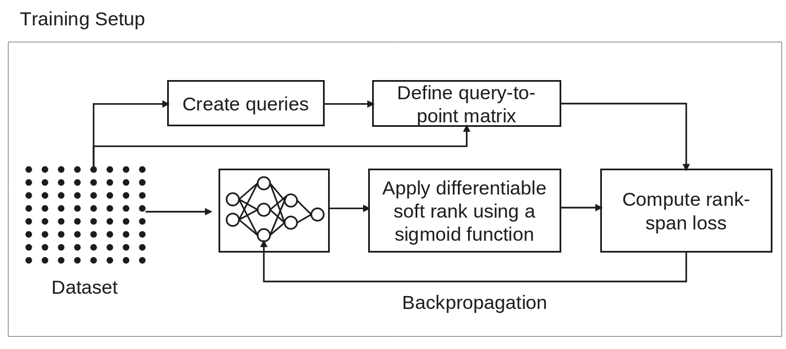
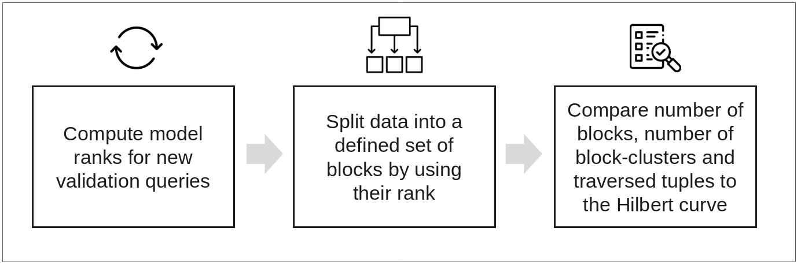
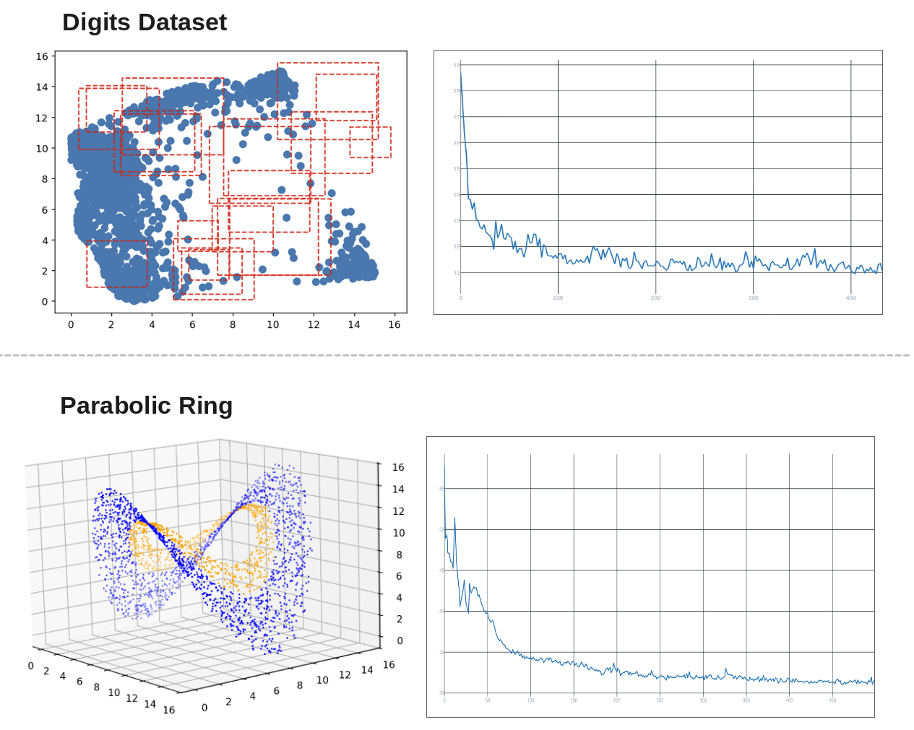

# The Neural Curve: A Machine Learning Approach for Adaptive Data Indexing
Space-filling curves like the Hilbert curve are widely used for indexing data but they represent a fixed mapping.
Thus, geometrical and topological aspects of the data is completely ignored by this approach. 
Furthermore, statistics over user queries don't influence space-filling curves as well (at least in the default setting).
The code of this is an approach to evaluate the concept of a "neural-curve" based on the example of Chen et al. (2025): https://zheng-kai.com/paper/2025_sigmod_chen.pdf

## Training of the Model

The model consists of a 5 dense layers with one short-cut connection (improving the performance significantly), with output size of 1.  
It can be defined as a function $f: \mathbb{R}^d \rightarrow \mathbb{R}$ projecting from a (more or less) high dimensional space to the real numbers. 
The input is a data point from a distinct dataset, while the output is corresponding 1D index.  

To evaluate the approach of learning index structures, I have designed a minimal setup:

- A deep-learning model containing five layers, projecting from data space (currently 2D or 3D) to 1D while first extending the data space stepwise to higher dimensions and then shrinking to 1D.

- A self-supervised approach: Given a set of data points and a set of range queries - learn to keep indices close for each query.

- I used temperature-scaled soft ranks of the model outputs, since classical ranking approaches (e.g. applying argsort twice) are usually not differentiable.

- A query-to-point matrix is used to calculate the loss. It has dimensions n_queries × n_points_in_the_dataset and contains a 1 if a data point is enclosed by a query, and 0 otherwise.

- Rank-span loss is defined as follows: for each query, compute the distance between the minimum and maximum rank. This value needs to be optimized by the model. 

$$
\mathcal{L}_{range span}(f,q) =\frac{1}{n} \sum_{i=1}^{n} \max_{x_j \in q_i} f(x_j)-\min_{x_j \in q_i} f(x_j)
$$

For evaluation, the model ranks are computed for a set of new queries.  
Those ranks are then split into N blocks of equal size. For evaluation metrics, I computed the following values: average number of blocks touched, average number of block clusters (subsequent blocks) built and average number of tuples read for retrieving data for queries. 

## Two experiments for model evaluation

### General settings
4 bits per axis (comparison to Hilbert curve on a fixed grid) 
370 fixed training queries + 7 random queries each epoch 
1000 evaluation queries

### 1st Experiment
Digits dataset compressed to 2D (1,800 points)
10 blocks
Rectangular range queries with random width, height, and position

### 2nd Experiment
Parabolic Ring  (2,500 points)
15 blocks
Queries defined by fractions of 2π and radius (essentially the pattern resembles a ring warped in three dimensions)

| Metric | Digits Dataset |  | Parabolic Ring |  |
|--------|---------------:|--|---------------:|--|
|        | Model | Hilbert curve | Model | Hilbert curve |
| Avg. # blocks* | 3.05 | 3.09 | 5.75 | 6.08 |
| Avg. # traversed tuples* | 548 | 554 | 959 | 1012 |
| Avg. # block cluster* | 1.08 | 1.45 | 1.07 | 1.91 |

Datasets with example queries and the loss curve for the ranking model For the Digits dataset, rectangular range queries are applied, whereas for the parabolic ring the queries are defined by a range between 0 and 2π and the minimum and maximum radius (example shown in orange)

## Evaluation of Single Queries

The plots in the following diagram show how the model defines the order of the data points 
The diagrams on the left side show the queries for the 3D dataset (graphs 1 and 2) and the rectangular queries of the Digits dataset (graph 3)  
Data points are connected according to the rank order defined by the model
The color of each point is determined by the block to which it was assigned  

The diagrams on the right show one bar for each block, covering the range of rank values of the block in gray and the rank ranges covered by the query in the distinct color of the block

### Initial Conclusions
As a proof of concept, the small model demonstrates that under certain settings, the Hilbert curve, as an industry standard, can be outperformed

Examples of point ordering and block assignment for single queries

